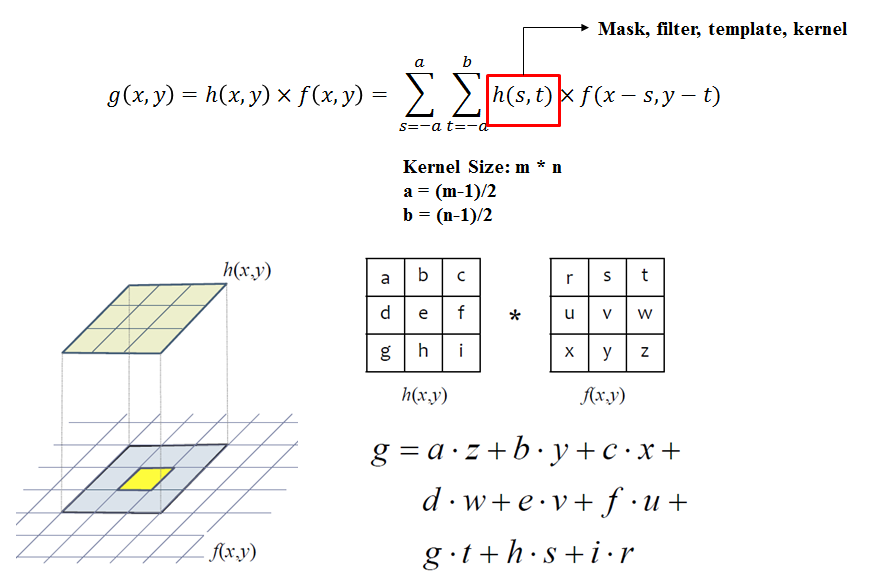
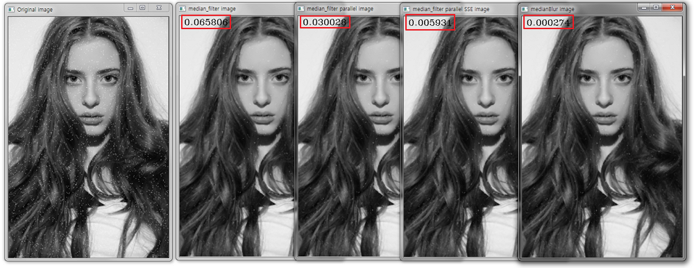

# Median

### Image Filtering

- Fourier 변환을 통하여 데이터를 주파수 성분으로 변경한 후, 주파수에 대하여 여러가지 가공 처리를 하기 위해 Filtering이란 개념이 나옴

- 이미지의 경우, 입력 신호가 주파수 형태가 아니라 이미지이기 때문에 Spatial Filtering

### Filter

- 유한 임펄스 응답 filter 

- 임펄스: 입력되는 이산적인 데이터

- 정해진 입력(유한개의 입력) 을 사용하여 정해진 가중치 곱의 합으로써 결과 도출

- Convolution

- Filtering 경계 처리

  - 특정 상수 값 삽입 (e.g. 0)
  
  - 경계에 있는 픽셀 값을 복사
  
  - 영상을 주기적인 신호로 해석하여 맞은 편 픽셀 값을 복사
  
  - 모든 이웃 픽셀이 정의되는 위치에서 Convolution 연산을 시작
  
### Image Smoothing

- 입력영상을 조금 부드럽게 하거나 잡음 (Noise) 을 제거하기 위해 사용

- Mean, Gaussian, Median Filter, etc

### Median Filter

- 마스크 범위 원소 중 중간값 취하여 출력화소로 결정하는 방식

- 마스크 범위내에 있는 화소값 정렬 필요

- Median Filter 직접 구현하여 라이브러리와 속도 비교

  - 이중 for 문 : 0.065806 ms
  
  - parallel : 0.030028 ms (이중 for 문 보다 2배 빠름)
  
  - parallel + SIMD : 0.005934 ms (이중 for 문 보다 11배 빠름)
  
  - OpenCV medianBlur 함수 : 0.000274 (이중 for 문 보다 240배 빠름)

